# SQL Dirty Data Generation & Excel Data Cleaning Project

## 💼 Business Problem

Organizations rely heavily on customer data for critical decision-making, including:

- **Customer Analysis** & Segmentation
- **Revenue Tracking** & Financial Forecasting
- **Marketing Campaigns** & Retention Strategies
- **Performance Dashboards** & Executive Reporting

### The Challenge

In real-world business environments, raw customer data is rarely pristine. It is
frequently plagued by:

| Data Quality Issue | Business Impact |
|---|---|
| ❌ **Inconsistent Entries** | Fragmented metrics and skewed totals |
| ❌ **Incomplete Records** | Missing critical demographic or transactional context |
| ❌ **Incorrect Formatting** | Broken data types (e.g., text in date fields) preventing automated pipelines |
| ❌ **Invalid or Duplicate Values** | Artificial inflation of customer counts and wasted marketing spend |

These issues lead to inaccurate reporting, flawed analytics, and unreliable
business insights.

---

## 🎯 Project Goal

The goal of this project is to simulate a real-world, "dirty" customer dataset
and execute an end-to-end transformation. By leveraging data cleaning and
engineering best practices, this pipeline turns chaotic raw data into a clean,
optimized, and analysis-ready source of truth suitable for reliable business
reporting.

> **Scope note:** This project currently covers data generation and cleaning
> (SQL + Excel). A Power BI dashboard for visualizing the cleaned dataset is a
> planned next phase.

---

## ❓ Business Questions

1. What proportion of customer records contain unusable contact information (invalid/missing email or phone)?
2. How many records have inconsistent or missing city/country values that would break geographic reporting?
3. How many transaction amounts are invalid or statistical outliers?
4. What percentage of the raw dataset is fully clean and analysis-ready after processing?
5. Which data quality issue affects the largest share of records, and should be prioritized in the source system?

---

## 📌 Project Overview

This project demonstrates an end-to-end data quality workflow using SQL and Excel.

First, a dirty customer dataset containing common real-world data quality
issues was generated in PostgreSQL using SQL scripts. The dataset was then
exported to Excel, where a complete data cleaning process was performed to
identify, correct, and validate data quality problems.

The project showcases both data generation and data cleaning skills commonly
used by data analysts when preparing datasets for reporting, dashboard
creation, and business analysis.

---

## 🗂️ Dataset Description

The dataset contains customer information including:

- Customer ID
- Name
- Email
- Phone Number
- City
- Country
- Signup Date
- Amount

A total of **500 records** were generated with intentional data quality issues
for cleaning practice.

---

## 📁 Project Structure

```text
sql-customer-dirty-data-generator/
│
├── Data/
│   ├── Raw/
│   │   └── customers_dirty.csv
│   │
│   └── clean/
│       └── customers_clean.csv
│
├── SQL/
│   └── customers_dirty_creation.sql
│
├── cleaning/
│   ├── clean_amount_1.png
│   ├── clean_amount_2.png
│   ├── clean_amount_3.png
│   ├── clean_city.png
│   ├── clean_country.png
│   ├── clean_date.png
│   ├── clean_email.png
│   ├── clean_phone_1.png
│   ├── clean_phone_f.png
│   ├── final_clean.png
│   ├── raw_phone.png
│   ├── raw_phone3.png
│   ├── raw_phone_2.png
│   └── trim(b2).png
│
└── README.md
```

---

# Phase 1 — SQL: Dirty Data Generation

## Step 1: Create Table

### Purpose

The first step was to create a table to store customer information.

All fields were intentionally created as `TEXT` data types to allow insertion
of invalid values, inconsistent formats, and other data quality issues without
database restrictions.


```sql
CREATE TABLE customers_dirty (
    id SERIAL PRIMARY KEY,
    name TEXT,
    email TEXT,
    phone TEXT,
    city TEXT,
    country TEXT,
    signup_date TEXT,
    amount TEXT
);
```

---

## Step 2: Insert Dirty Data

To replicate real-world scenarios, a PostgreSQL script was used to generate
500 customer records. The dataset was intentionally designed with common data
quality issues found in enterprise systems:

- inconsistent text formatting
- invalid email addresses
- missing phone numbers
- incorrect country codes
- mixed date formats
- unrealistic financial values and outliers

This simulates real challenges faced in CRM, sales, and customer analytics
systems.

### SQL Concept Used

- generate_series()
- INSERT INTO
- CASE WHEN

```sql
INSERT INTO customers_dirty (
    name,
    email,
    phone,
    city,
    country,
    signup_date,
    amount
)
SELECT

    -- Messy Names
    CASE
        WHEN i % 10 = 0 THEN '  Ali Khan  '
        WHEN i % 7 = 0 THEN 'Sara Ahmed'
        ELSE 'User ' || i
    END,

    -- Invalid Emails
    CASE
        WHEN i % 15 = 0 THEN 'invalidemail.com'
        WHEN i % 9 = 0 THEN 'test@test.com'
        ELSE 'user' || i || '@gmail.com'
    END,

    -- Invalid Phone Numbers
    CASE
        WHEN i % 12 = 0 THEN NULL
        WHEN i % 5 = 0 THEN '123-456-789'
        ELSE '03' || (100000000 + i)::TEXT
    END,

    -- Inconsistent Cities
    CASE
        WHEN i % 6 = 0 THEN 'karachi'
        WHEN i % 8 = 0 THEN 'LAHORE'
        WHEN i % 11 = 0 THEN ''
        ELSE 'Islamabad'
    END,

    -- Wrong Countries
    CASE
        WHEN i % 10 = 0 THEN 'IND'
        ELSE 'Pakistan'
    END,

    -- Mixed Date Formats
    CASE
        WHEN i % 13 = 0 THEN '12-05-2023'
        ELSE '2023-01-' || ((i % 28)+1)
    END,

    -- Outliers & Invalid Amounts
    CASE
        WHEN i % 20 = 0 THEN '999999'
        WHEN i % 17 = 0 THEN 'abc'
        ELSE (100 + i)::TEXT
    END

FROM generate_series(1,500) i;
```

## Step 3: Simulate Data Quality Issues

### Purpose

Real business data is rarely perfect.

The dataset was intentionally populated with common data quality problems that analysts frequently encounter.

### Issues Introduced

| Column | Data Quality Issue |
|----------|----------------|
| Name | Leading and trailing spaces |
| Email | Invalid and duplicate emails |
| Phone | Missing values and invalid formats |
| City | Inconsistent capitalization |
| Country | Incorrect country abbreviations |
| Signup Date | Mixed date formats |
| Amount | Invalid values and outliers |

---

### Final Preview

```sql
SELECT *
FROM customers_dirty;
```

### Raw Dataset

[View Raw Dataset](Data/Raw/customers_dirty.csv)

---

# 2️⃣ Excel Data Cleaning Process

## Step 1: Inspect the Dataset

### Checked all columns for:

- Missing values
- Duplicate records
- Invalid formats
- Inconsistent text
- Outliers
- Incorrect data types

---

## Step 2: Clean Name Column

### Issue Identified

Some customer names contained unnecessary leading and trailing spaces.

### Example

Before:

```text
"  Ali Khan  "
```

After:

```text
"Ali Khan"
```

### Formula Used

```excel
=TRIM(B2)
```

### Why?

TRIM removes extra spaces and improves consistency.

### Cleaning Evidence

.png)

---

## Step 3: Clean Email Column

### Issues Identified

- Invalid email addresses
- Test email accounts

### Examples

```text
invalidemail.com
test@test.com
```

### Formula Used

```excel
=IF(C2="invalidemail.com","Invalid_Format",
IF(C2="test@test.com","Test/Fake_Email","Valid"))
```

### Why?

Email validation helps identify records requiring correction before communication or analysis.

### Cleaning Evidence

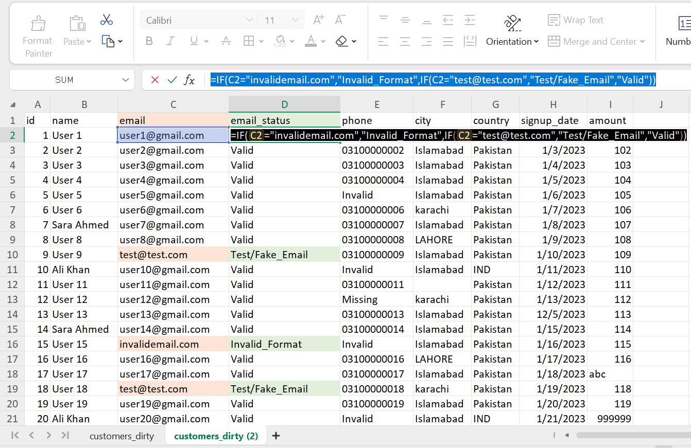

---

## Step 4: Review Phone Number Column

### Issues Identified

- Missing values
- Invalid phone formats
- Inconsistent formatting
- Excel "Number Stored as Text" warnings (green triangles)

### Why Were Green Triangles Appearing?

The phone number column was imported as text, causing Excel to display green error indicators with the message:

```text
Number Stored as Text
```

Phone numbers are identifiers rather than values used for mathematical calculations. Therefore, storing them as text is the recommended approach because it preserves leading zeros and prevents unwanted formatting changes.

### Remove Green Triangle Warnings

To improve worksheet readability:

1. File
2. Options
3. Formulas
4. Error Checking Rules
5. Uncheck:

```text
Numbers Formatted as Text or Preceded by an Apostrophe
```

6. Click OK

### Examples

```text
NULL
123-456-789
03123456789
```

### Actions Taken

- Removed Excel warning indicators
- Identified missing phone numbers
- Validated phone number length
- Flagged invalid phone formats

### Formula Used

```excel
=IF(E2="NULL",
"Missing",
IF(LEN(SUBSTITUTE(E2,"-",""))<>11,
"Invalid",
E2))
```

### Why?

The formula:

- Identifies missing phone numbers
- Removes dashes for validation
- Checks whether the phone number contains 11 digits
- Flags invalid records for further review

### Cleaning Evidence

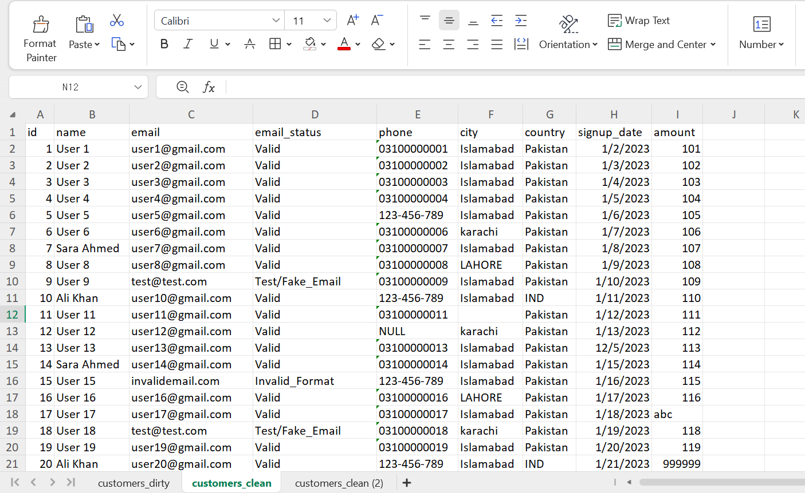

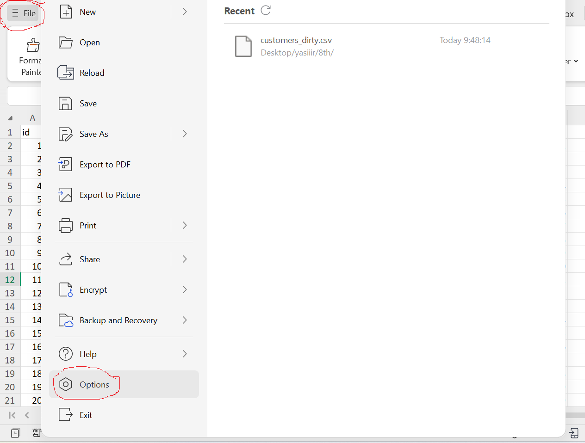

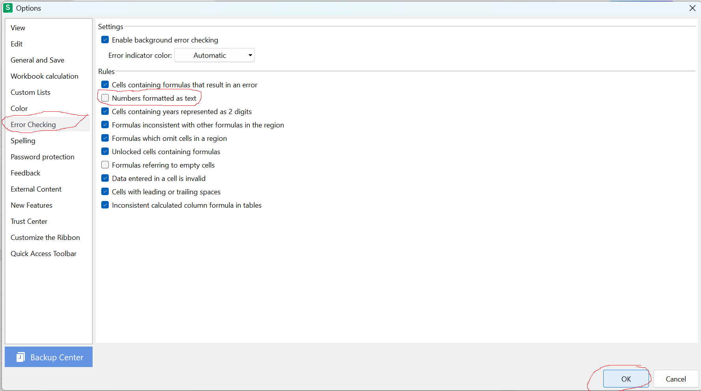

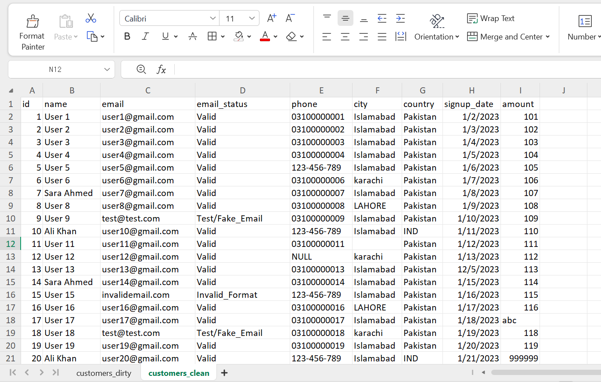

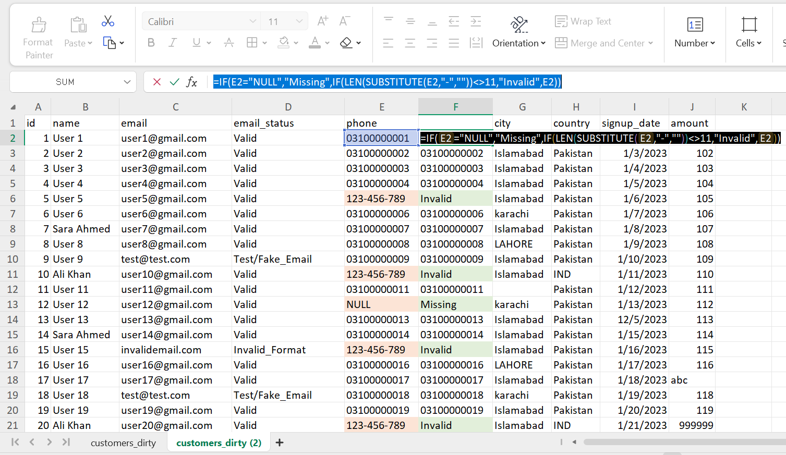

---

## Step 5: Clean and Standardize City Names

### Issues Identified

- Inconsistent capitalization
- Missing city values (blank cells)

### Examples

Before Cleaning:

```text
karachi
LAHORE
Islamabad
(blank)
```

### Formula Used

```excel
=PROPER(IF(F2="","Missing",F2))
```

### Actions Taken

- Replaced blank city values with "Missing"
- Standardized city names into Proper Case format

### Why?

The formula performs two cleaning tasks:

**1. Handle Missing Values**

```excel
IF(F2="","Missing",F2)
```

Checks whether the city cell is blank.

If blank, it replaces the value with:

```text
Missing
```

This makes missing records easier to identify during analysis instead of leaving empty cells.

**2. Standardize Text Format**

```excel
PROPER(...)
```

Converts city names into Proper Case.

Examples:

```text
karachi   → Karachi
LAHORE    → Lahore
islamabad → Islamabad
```

Standardized city names improve:

- Data consistency
- Filtering and sorting
- Pivot Tables
- Grouping and aggregation
- Dashboard reporting accuracy

### Cleaning Evidence

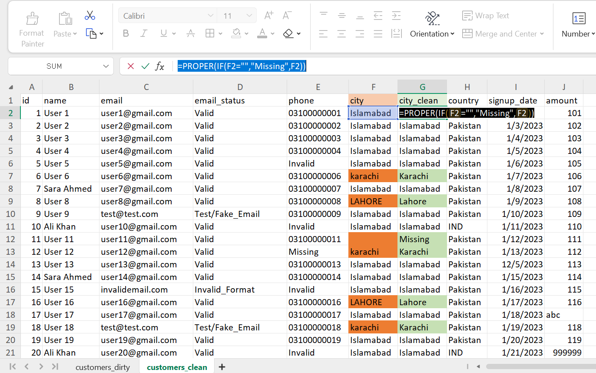

---

## Step 6: Standardize Country Names

### Issue Identified

Country abbreviations:

```text
IND
```

### Formula Used

```excel
=PROPER(IF(G2="IND","India",G2))
```

### Why?

Ensures consistent country naming for analysis.

### Cleaning Evidence

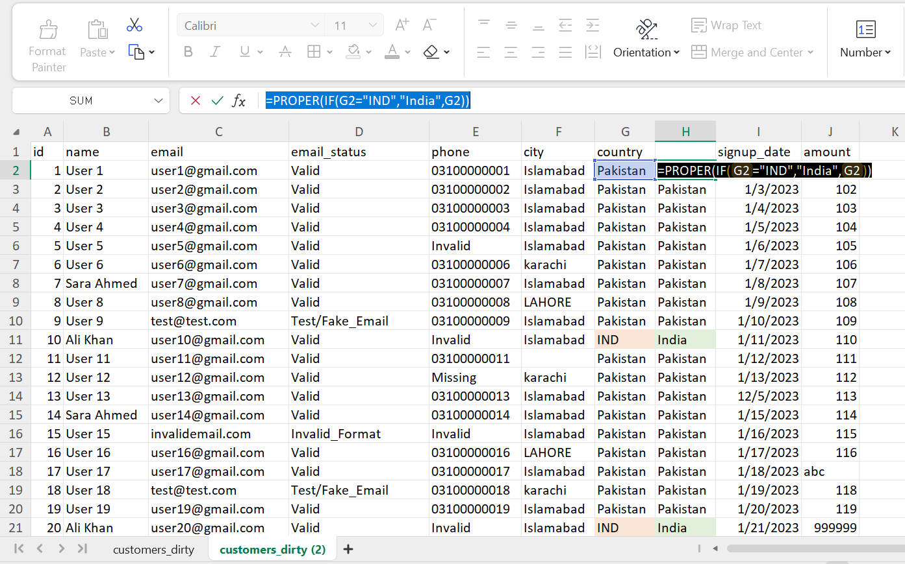

---

## Step 8: Clean and Validate Amount Column

### Issues Identified

- Non-numeric values
- Potential outliers
- Incorrect data types

### Examples

Invalid Values:

```text
abc
```

Potential Outliers:

```text
999999
```

### Formula Used

```excel
=IF(AND(ISNUMBER(I2),I2<10000),I2,"")
```

### Actions Taken

- Identified valid numeric values
- Removed non-numeric entries
- Flagged extreme outliers
- Converted text values to numeric format
- Standardized decimal formatting

### Why?

The formula:

```excel
=IF(AND(ISNUMBER(I2),I2<10000),I2,"")
```

performs two validation checks:

**1. Numeric Validation**

```excel
ISNUMBER(I2)
```

Checks whether the value is numeric.

Examples:

```text
150   → Valid
abc   → Invalid
```

**2. Outlier Validation**

```excel
I2 < 10000
```

Checks whether the amount falls within a reasonable range.

Examples:

```text
450    → Valid
999999 → Outlier
```

Only values that pass both conditions are retained.

If either condition fails, the formula returns a blank value.

This helps ensure that only valid transaction amounts are kept for analysis.

### Data Type Conversion

After validating the values, the Amount column was converted from **Text** to **Number** format.

### Why?

Numeric data types are required for:

- SUM calculations
- Averages
- Revenue analysis
- Pivot Tables
- Charts and dashboards

Without converting the data type, Excel may treat numbers as text and calculations may produce incorrect results.

### Decimal Standardization

After converting the column to a numeric data type, unnecessary decimal places were reduced.

Example:

```text
125.000000 → 125
250.500000 → 250.5
```

### Why?

Reducing excessive decimal places:

- Improves readability
- Makes reports cleaner
- Produces more professional dashboards
- Prevents visual clutter

### Cleaning Evidence

**Validation of Numeric Values and Outliers**

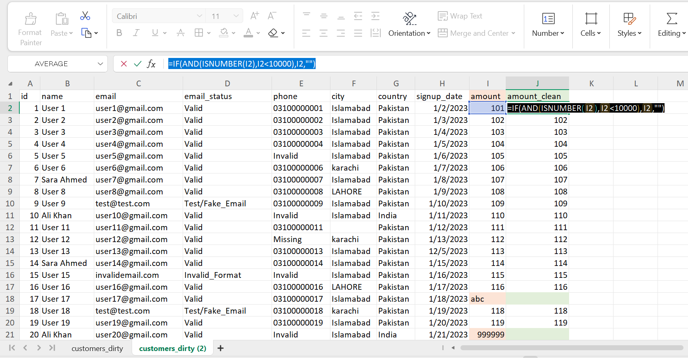

**Conversion from Text to Number Data Type**

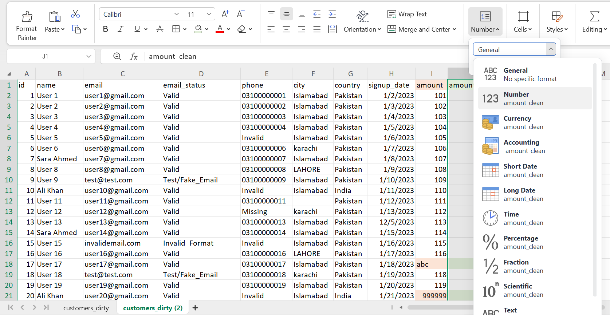

**Standardized Decimal Formatting**

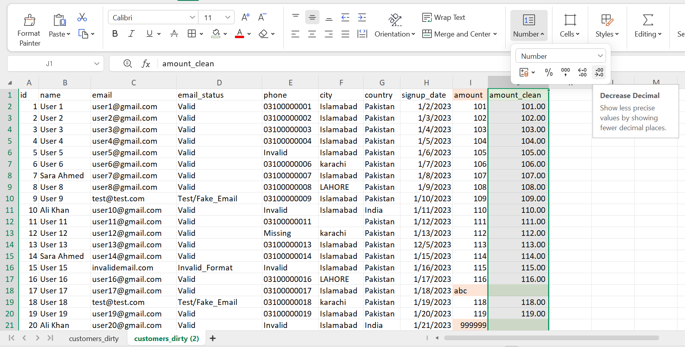

---

## Step 9: Standardize Date Formats

### Issue Identified

Mixed date formats:

```text
2023-01-15
12-05-2023
```

### Final Format

```text
YYYY-MM-DD
```

### Why?

Consistent dates are required for trend analysis and reporting.

### Cleaning Evidence

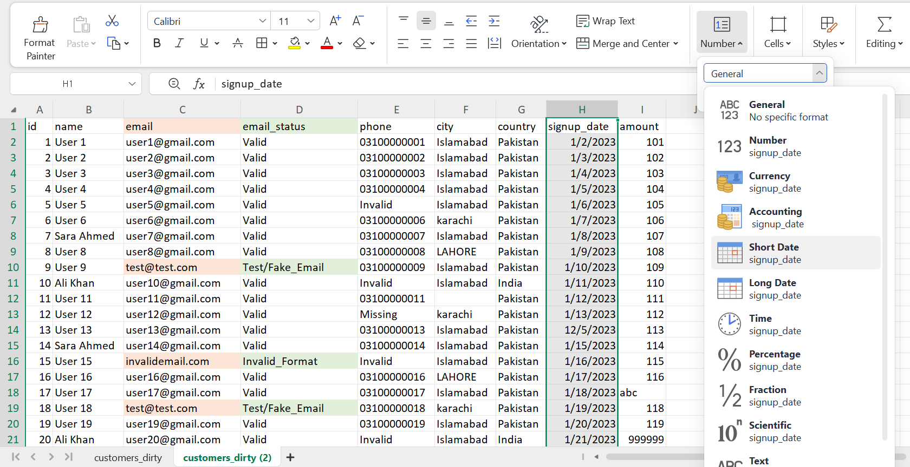

---

# 3️⃣ Final Clean Dataset

After all cleaning steps were completed, the dataset became:

✅ Consistent

✅ Standardized

✅ Analysis-ready

### Final Output

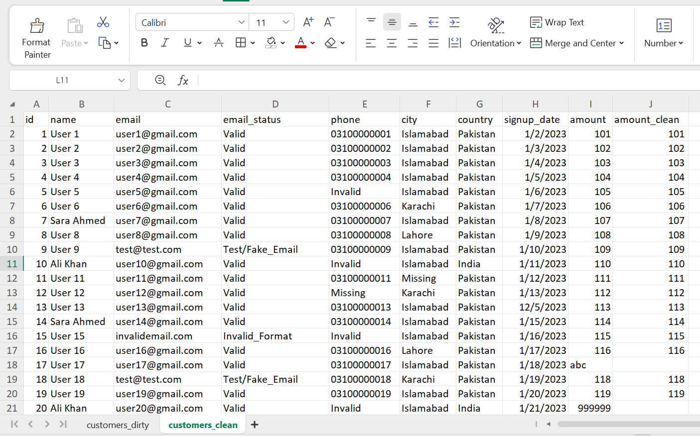

---

# 📊 Data Quality Issues Resolved

| Issue | Status |
|---------|---------|
| Leading Spaces | ✅ Fixed |
| Invalid Emails | ✅ Flagged |
| Missing Phones | ✅ Identified |
| Invalid Phones | ✅ Flagged |
| Inconsistent Cities | ✅ Standardized |
| Incorrect Countries | ✅ Standardized |
| Mixed Dates | ✅ Standardized |
| Invalid Amounts | ✅ Investigated |
| Missing Values | ✅ Handled |

---

## 📈 Business Impact

After cleaning the dataset:
* **Data accuracy was significantly improved** for reporting purposes
* **Invalid, missing, and inconsistent records** were identified and handled
* **Dataset became suitable** for business intelligence dashboards and KPI reporting
👉 **This ensures that business stakeholders can make decisions based on clean and trustworthy data.**

# 🧠 SQL Concepts Used

- CREATE TABLE
- INSERT INTO
- CASE WHEN
- generate_series()
- Data Quality Simulation

---

# 📈 Skills Demonstrated

- Data Cleaning
- Data Validation
- Data Quality Assessment
- Excel Functions
- SQL Data Generation
- Data Preparation
- Business Data Standardization

---

## 📊 Phase 3: Power BI

### Problem Definition

Leadership suspects that inconsistent and low-quality customer data may be causing inaccurate revenue reporting and unreliable customer counts, undermining confidence in dashboards used for business decisions. This phase quantifies how much the raw data was distorting the numbers, cleans and validates it, and determines what revenue and customer-acquisition picture the business can actually trust.

**Stakeholder question:** *How much of our reported revenue and customer base was actually real — and where should we focus our acquisition efforts based on the reliable data?*

---

### 🧮 Technical Implementation (DAX Measures)

All calculations behind the dashboard were built using DAX measures rather than hardcoded values, so every number updates automatically if the underlying data changes.

**Raw table measures (customers_dirty):**
```dax
Total Raw Customers = COUNTROWS(raw_customers)

Total Raw Revenue = 
SUMX(raw_customers, IFERROR(VALUE(raw_customers[amount]), 0))
```
`Total Raw Revenue` uses `SUMX` to go row by row, `VALUE()` to convert the text `amount` column into a number, and `IFERROR()` to treat any non-numeric entry (like "abc") as 0 instead of breaking the calculation. This preserves the raw data's mess intentionally, so it can be compared honestly against the cleaned figures.

```dax
Invalid Amount Count = 
COUNTROWS(FILTER(raw_customers, ISERROR(VALUE(raw_customers[amount]))))
```
Counts how many rows could not be converted to a valid number — i.e., how many amount entries were genuinely invalid.

```dax
Missing Phone Count = 
CALCULATE(COUNTROWS(raw_customers), raw_customers[phone] = "NULL")

Invalid Phone Format Count = 
CALCULATE(COUNTROWS(raw_customers), 
    raw_customers[phone] <> "NULL" && 
    LEN(SUBSTITUTE(raw_customers[phone], "-", "")) <> 11)

Blank City Count = 
CALCULATE(COUNTROWS(raw_customers), raw_customers[city] = "")
```

**Clean table measures (customers_clean):**
```dax
Total Clean Customers = COUNTROWS(clean_customers)

Total Clean Revenue = SUM(clean_customers[amount_clean])

Avg Clean Transaction Value = AVERAGE(clean_customers[amount_clean])

Invalid Format Email Count = 
CALCULATE(COUNTROWS(clean_customers), clean_customers[email_status] = "Invalid_Format")

Test Fake Email Count = 
CALCULATE(COUNTROWS(clean_customers), clean_customers[email_status] = "Test/Fake_Email")

Total Bad Email Count = 
CALCULATE(COUNTROWS(clean_customers), clean_customers[email_status] <> "Valid")
```

**Revenue Comparison table (for the Page 1 bar chart):**

Since Raw Revenue and Clean Revenue live as separate measures on two different tables, a small standalone table was built to hold both values as chartable rows:

```dax
Revenue Comparison = 
UNION(
    ROW("Type", "Raw Revenue", "Value", [Total Raw Revenue]),
    ROW("Type", "Clean Revenue", "Value", [Total Clean Revenue])
)
```
`ROW()` builds a single row with a `Type` label and a `Value`, referencing the actual measure result (unlike `DATATABLE()`, which only accepts hardcoded constants and cannot reference measures). `UNION()` then stacks the two one-row tables into a single two-row table, giving the bar chart one column for category labels (`Type`) and one for values (`Value`).

---

### 🐞 Data Issue Found During Analysis

While building Page 2, a data issue was discovered that had not been caught during the original SQL/Excel cleaning stage:

**Issue:** Every record where `country = India` actually had a Pakistani city (Islamabad, Karachi, or Lahore) instead of an Indian one.

**Root cause:** The original SQL script's random data generator selected `city` and `country` independently of each other, rather than pairing valid city–country combinations. Since the city list only ever contained Pakistani cities, any row randomly assigned "India" as its country still pulled from that same fixed list.

**Fix:** Since every "India" row was consistently paired with a real Pakistani city, this confirmed the **country** field — not the city — was the incorrect value. The fix was applied in **Power Query** using a `Replace Values` step: `India → Pakistan`. This was done deliberately at the Power Query stage to keep the transformation visible, documented, and reproducible as part of the Power BI data model.

Country/City Mismatch Count found: **50**

---

### Dashboard Structure

The Power BI report is built as a 3-page story, moving from **problem → evidence → decision**:

#### Page 1 — Data Quality Impact
Compares the raw (dirty) dataset against the cleaned dataset side by side, to quantify exactly how much the bad data was distorting the numbers.

- Total Raw Customers: **500**
- Total Clean Customers: **500**
- Total Raw Revenue: **25.16M**
- Total Clean Revenue: **156.395k**
- Revenue overstatement: **99.38%** *(see formula explanation below)*
- Invalid Amount Count: **28**
- Invalid Format Email Count: **33**
- Test/Fake Email Count: **44**
- Missing Phone Count: **41**
- Invalid Phone Format Count: **92**
- Blank City Count: **34**
- Country City Mismatch Count: **50**

**Formula used for revenue overstatement:**
```
(Raw Revenue − Clean Revenue) ÷ Raw Revenue × 100
```
This calculates what percentage of the raw reported revenue was actually inflated or invalid. Step by step:
1. Subtract clean revenue from raw revenue to find the gap (the "fake" revenue caused by bad data).
2. Divide that gap by the raw revenue to turn it into a fraction of the whole.
3. Multiply by 100 to express it as a percentage.

In plain terms: *out of everything the raw data claimed as revenue, what percentage of that was actually wrong or inflated?*

#### Page 2 — Customer & Revenue Insights
Analyzes only the cleaned, trustworthy data to answer real business questions: which cities generate the most revenue, which have the highest average transaction value, and where the customer base is concentrated.

- Total Clean Customers: **500**
- Total Clean Revenue: **156.395k**
- Average Clean Transaction Value: **349.88**
- City with highest total revenue: **Islamabad**
- City with highest average transaction value: **Lahore**

---

#### Page 3- Insights and Recommendations
##### 💡 Key Insights

**Data Quality:**
> Raw customer data contained significant quality issues that would have distorted business reporting if used as-is. Raw revenue was overstated by approximately **99.38%%** due to invalid and outlier amount entries. **77** records had invalid or test/fake email addresses, and **133** records had missing or invalid phone numbers. Additionally, a systematic data generation issue was found and corrected, where all records marked "India" actually contained Pakistani cities. After cleaning, the trustworthy customer base is **500** records with total revenue of **156.395k**.

**Customer & Revenue:**
> **Islamabad** has the highest total revenue, driven by higher customer count. However, **Lahore** shows the highest average transaction value per customer. This tells us something useful: the city with the most money isn't always the city with more customers. **Lahore** might be worth more attention, since its customers are already spending more per person — growing that city could bring in even more revenue than just relying on **Islamabad**'s larger customer base.

---

##### ✅ Recommendations

1. Focus our marketing budget on **Lahore** city with highest average value , since customers there spend the most on average.
2. Fix the signup page to check phone and email fields, since these two areas were our biggest sources of bad data.
3. Investigate and fix the country/city data generation logic to prevent similar mismatches in future data collectio

---

### 🛠️ Tools Used
SQL (PostgreSQL) → Excel (data cleaning) → Power BI (Power Query + DAX + interactive reporting)

---
*This section documents the Power BI extension of the SQL + Excel data cleaning project — showing the complete analytics process from problem definition through business recommendations.*
---

# 👤 Author

**Yasir Shah**

Data Analyst | SQL | Excel
